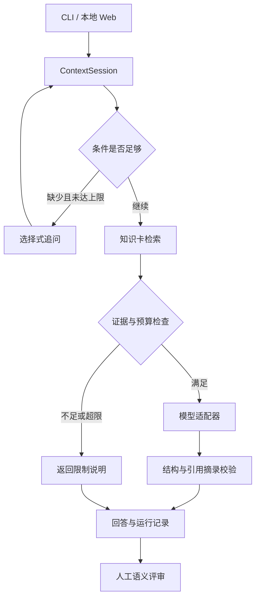

# LureSense：有界上下文与证据支持的淡水路亚助手

## 项目目标

面向淡水大口黑鲈知识咨询，将模糊问题转为可追溯的条件化检索与回答。项目关注条件是否明确、知识是否可追溯、缺少证据时是否停止生成。不能检测现场是否有鱼，不预测中鱼率，也未接入偏光眼镜或实时视觉。

这是个人维护的工程项目。核心采用 Python 标准库，Web 为本地 HTML/CSS/JavaScript 界面；当前知识库22张卡，检索采用关键词/概念匹配。

## 架构

离线 benchmark 单独调用同一状态与检索模块，对照 direct、append_context、agent_state；不经过真实模型适配器。

## 当前实现与可检查证据

| 能力 | 实现位置 | 如何检查 |
| --- | --- | --- |
| 问题路由、最多两项追问 | context_agent.py | tests/test_context_agent.py |
| 未知状态、显式修正、调用预算 | context_agent.py | 修改可见结构后检查查询与事件 |
| 来源管理与知识检索 | retriever.py、data/ | 检查知识卡来源与相关卡召回 |
| 真实模型适配 | llm.py | 用户已完成过真实接口接入；本轮未再次调用 |
| 引用摘录校验 | grounding.py | 检查错引和伪造摘录被拒绝 |
| 记录与人工审查 | review_runs.py | 检查来源文件哈希与逐主张评审 |
| 本地交互演示 | web_app.py、web/ | 补条件、改条件、看证据、导出 |
| 三组实验 | benchmark_v05.py | 30情景、90条组别结果、失败案例 |
| 自动回归配置 | .github/workflows/luresense-ci.yml | push 后查看 GitHub Actions |

## 怎样展示设计与工作量

把仓库导读、模块职责、设计决策、测试、实际报告和失败分析连起来。演示“模糊问题 → 补条件 → 查看依据 → 修改条件 → 重检索 → 导出审查”；再打开实验报告解释一条成功案例和一条失败案例。

设计取舍见 docs/adr/0001-bounded-agent-and-evaluation.md，实验定义见 docs/EXPERIMENT_DESIGN_V05.md，实测离线结果见 reports/v05_baseline/REPORT.md。这些相对路径以仓库根目录为参照。

不要把代码量、测试数量或单一命中率当成项目价值的全部。你需要能讲清条件表示、基线的公平性、标注的局限，以及下一次改动应如何证明有效。

## 尚未完成的验证

本轮不是独立现场验证，没有专家复核相关卡标注，没有真实模型成对质量实验。Web 视觉与点击验收仍需在用户 Mac 上完成。GitHub CI 配置已写入，但需要推送后验证托管运行。

当前主要缺陷包括否定范围误判、规则同义表达覆盖有限、部分相关卡召回不足。保留这些缺陷及其案例，可以指导后续改动与验证。
